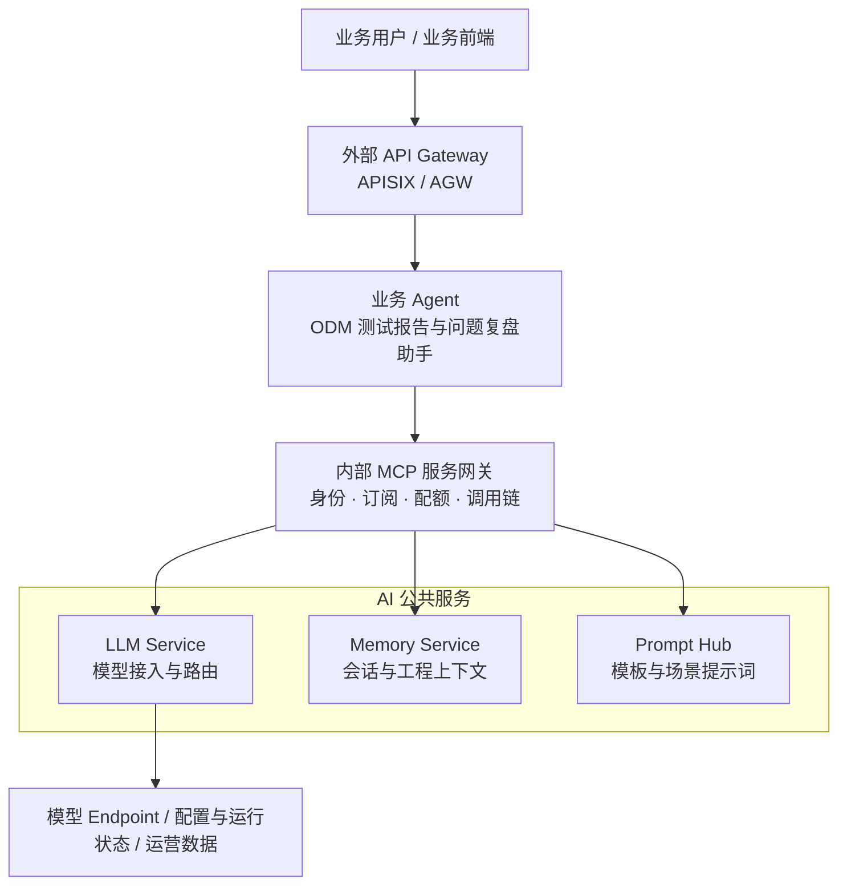

# XZY ODM Agent Hub

面向 ODM 研发测试场景的 AI Agent 公共能力治理 Demo。

以“业务 Agent + 内部 MCP 服务网关 + AI 公共服务”为核心结构，展示模型接入、会话记忆、Prompt 管理、项目身份、调用链、模型路由与流式治理如何由平台能力统一承接。

业务 Agent 只关注报告、复盘等业务编排，不直接管理底层服务地址与模型接入细节。

## 项目体验

启动后默认进入网关服务台：

| 入口 | 地址 | 用途 |
| --- | --- | --- |
| 网关服务台 | `http://127.0.0.1:8500` | 查看服务注册、项目身份、模型路由、调用链、用量、可靠性与流式验证。 |
| ODM 测试报告与问题复盘助手 | `http://127.0.0.1:8502` | 作为服务台已接入业务 Agent 的示例应用，生成测试报告、问题复盘、风险说明和回归验证记录。 |

服务台：服务状态、调用链、Token 用量、路由结果与流式验证均来自本地运行中的真实服务。

## 架构总览



### 职责边界

| 层级 | 在企业架构中的职责 | 本地 Demo 展示 |
| --- | --- | --- |
| 外部 API Gateway | 作为低时延数据面承接外部流量、认证、限流、路由、熔断和入口观测。 | 预留 APISIX / AGW 接入边界；本地业务入口由 FastAPI 服务直接提供。 |
| 控制面 | 管理模型、Endpoint、项目、订阅、Key、路由、价格、配额和预算，并发布运行时配置。 | 网关服务台提供项目、订阅、Endpoint 与逻辑场景路由的管理体验。 |
| 内部 MCP 服务网关 | 统一 Agent 到 MCP 公共服务的访问，执行项目身份、订阅校验、调用链和配额治理。 | 完整展示真实业务 Agent 的内部服务调用链。 |
| AI 公共服务 | 提供模型、记忆和 Prompt 等可复用能力。 | LLM Service、Memory Service、Prompt Hub 三项服务均可健康检查。 |
| 运营面 | 汇聚调用日志、Token、成本、异常和性能指标，用于分析与运营决策。 | 服务台展示调用明细、Token、估算成本、TTFT、重试和路由结果。 |

## 平台能力矩阵

以下能力均可在网关服务台或业务助手中体验。状态表示当前本地 Demo 已展示的能力范围，不等同于完整生产基础设施部署。

| 能力 | 当前展示 | 可体验位置 | 能力说明 |
| --- | --- | --- | --- |
| 统一接入 | 已展示 | 服务注册、业务助手 | Agent 通过统一内部 MCP 服务网关访问共享能力。 |
| API Key 身份识别 | 已展示 | 项目与身份 | 根据调用方身份识别项目，用于隔离会话、配额与调用记录。 |
| Token 日配额 | 已展示 | 项目与身份、用量与成本 | 支持项目维度 Token 使用量与日额度管理。 |
| 调用链可观测 | 已展示 | 调用链、报告助手调用轨迹 | 使用 `chain_id` 串联一次 Agent 编排，并保留服务步骤、状态与耗时。 |
| MCP 服务注册与健康检查 | 已展示 | 服务注册 | 统一展示已注册服务、协议、地址、工具数量与实时健康状态。 |
| 逻辑模型 / 场景 | 已展示 | 模型服务 | 业务调用逻辑场景，由平台解析实际模型与 Endpoint。 |
| 多 Endpoint 路由 | 已展示 | 模型服务、可靠性治理 | 支持主备 Endpoint、逻辑场景路由及实际路由结果查看。 |
| 模型 / 场景订阅权限 | 已展示 | 项目与身份 | 在请求模型前验证项目是否订阅目标场景。 |
| 用量与成本视图 | 已展示 | 用量与成本 | 展示调用次数、Token、估算成本、状态、耗时与路由结果。 |
| 重试、熔断与 Fallback | 已展示 | 可靠性治理、流式验证 | 对可重试错误执行有限重试；连续失败后暂时摘流，并尝试备用 Endpoint。 |
| SSE 流式治理与 TTFT | 已展示 | 流式验证、业务助手 | 模型文本逐段返回，记录首段到达时间、总耗时、Token、重试与最终 Endpoint。 |

## 服务台导航

能力矩阵说明平台“具备什么能力”；服务台则按使用目的提供入口：

| 页面分组 | 对应入口 |
| --- | --- |
| 控制面 | 项目与身份、模型服务：管理项目、订阅、Endpoint 与逻辑场景路由。 |
| 运行态 | 服务注册、可靠性治理：查看服务健康、Endpoint 状态与路由决策。 |
| 运营观测 | 调用链、用量与成本、流式验证：查看调用过程、用量、时延和流式事件。 |
| 业务接入 | 业务应用：跳转到已接入的 ODM 测试报告与问题复盘助手。 |

## 本地启动

```bash
cd mcp-demo
uv sync
cp .env.example .env
```

`.env.example` 已列出模型服务、网关治理、服务台连接和可选备用 Endpoint 的配置项。至少填写 `ARK_API_KEY`、`ARK_CHAT_MODEL` 和 `ARK_EMBEDDING_MODEL`；其余变量按文件内注释配置。完成后：

```bash
./start.sh
```

启动脚本会输出服务台与业务应用地址。按 `Ctrl+C` 可停止本次启动的服务。

## Demo 边界与企业映射

本项目重点展示 AI 网关的能力分层、治理闭环和真实调用链，而不是替代企业生产基础设施。

| 本地 Demo | 企业生产环境映射 |
| --- | --- |
| FastAPI 业务入口与内部 MCP 服务网关 | APISIX / AGW 承担外部高性能数据面；内部网关按企业服务治理体系部署。 |
| SQLite 控制面数据 | Redis / 配置中心承载低时延运行时配置，并通过发布机制热更新。 |
| 单实例内存熔断与回放缓存 | 共享健康状态、分布式限流、集中监控与高可用部署。 |
| 本地调用明细与服务台视图 | Kafka、Flink、数仓与可观测平台承接异步日志、计费、异常分析和运营看板。 |
